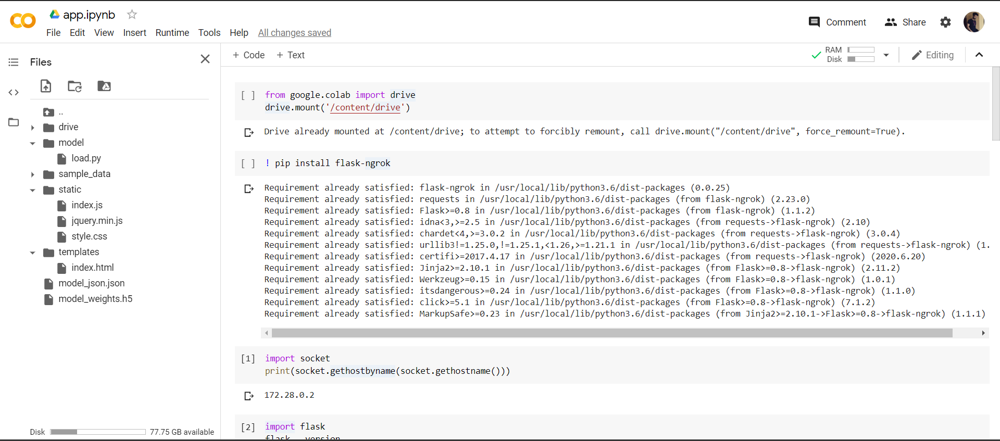

This folder contains the model deployment of MNIST Digit Recognition Model on webpage.

Note: The Webpage deployment is being done through ipynb so there is some problem in GET and POST request which will be resolved soon.

Also simple deployment using the python scripts can also be done easily through these codes.

The sample of folder arrangements for colab deployment can be seen below:

